# Using epublate (curator's walkthrough)

This guide walks a brand-new curator from a clean machine to an
exported, validated translated ePub. It assumes you've already
followed the README's _Quickstart (development)_ section to install
`uv`. If you're running the released package instead, swap
`uv run epublate` for `epublate` (or `uvx epublate ...`) throughout.

The example uses the in-tree [`docs/Sample.epub`](Sample.epub) so you
can take the whole loop for a spin without an LLM key.

---

## 1. Launch the TUI

The default home is the TUI. Run `epublate` with no arguments and you
land on the **Projects screen**: a list of recently-opened projects
plus the keys that drive the rest of the app.

```bash
uv run epublate --mock-llm
```

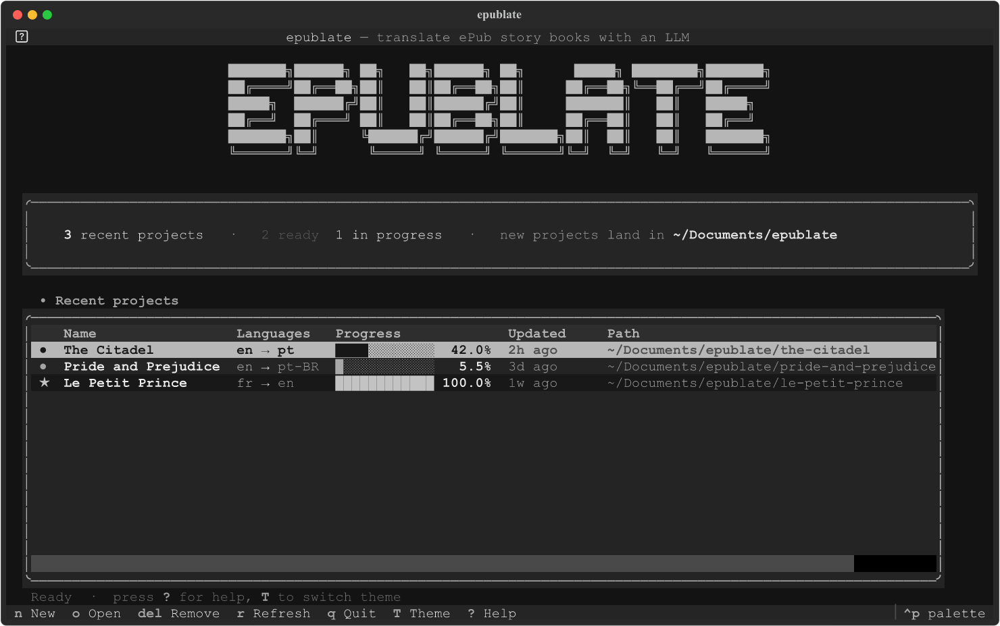

| Key       | Action                                                                |
| --------- | --------------------------------------------------------------------- |
| `n`       | New project (modal: source ePub, target / source lang, out dir)       |
| `o`       | Open an existing project by path                                      |
| `enter`   | Open the highlighted recent project                                   |
| `delete`  | Drop the highlighted entry from recents — confirm `y/n`; files kept   |
| `D`       | **Delete project** — wipe folder + SQLite DB; confirm by typing name  |
| `r`       | Refresh / prune entries whose folders no longer exist                 |
| `T`       | Cycle theme (dark → light → high-contrast)                            |
| `? / F1`  | Cheat sheet for the current screen                                    |
| `q`       | Quit                                                                  |

`delete` is reversible — it only forgets the entry in
`~/.config/epublate/recents.json`. `D` (capital) is the destructive
twin: it wipes the whole project folder (the SQLite DB, the
`original.epub` copy, every export) after the curator types the
project name back as a hard confirmation. Use it for abandoned
experiments; reach for `delete` for anything you might still want.

The recents list lives at `~/.config/epublate/recents.json` and is
written every time you create or open a project (whether from the
TUI or the CLI). Pressing `enter` on a row pushes the Project
Dashboard.

Pressing `n` opens the **New Project** modal (or `o` for **Open
Project**); both let you bootstrap or import a project without
leaving the TUI:

| New project (`n`) | Open project (`o`) |
| --- | --- |
| 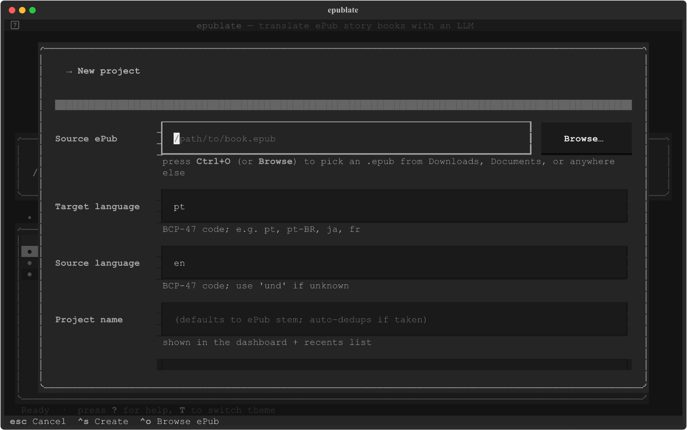 | 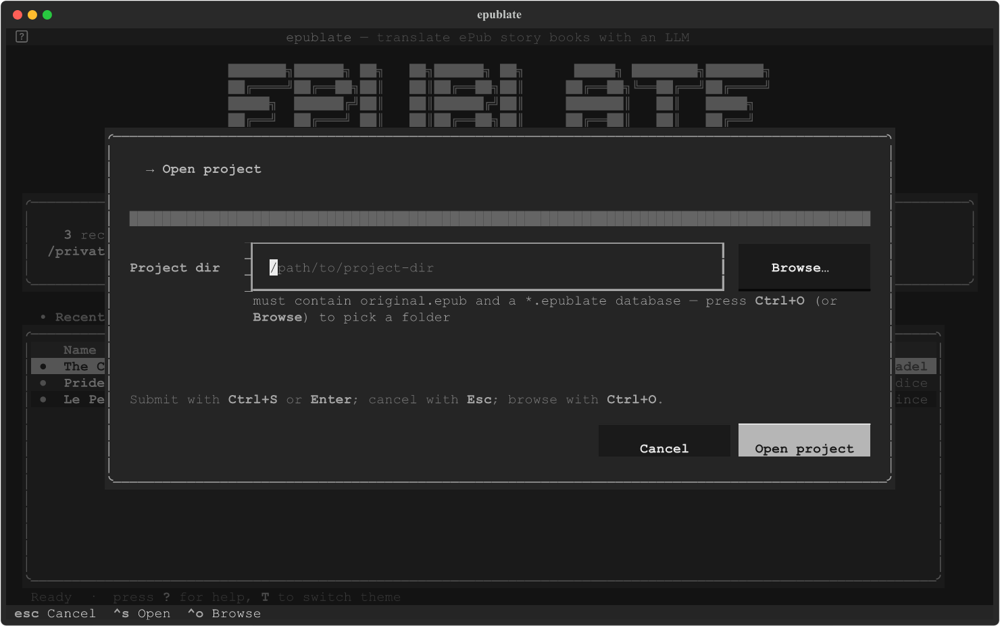 |

## 1b. CLI bootstrap (scripts / CI)

The TUI flow is the recommended path. If you want to scaffold a
project headlessly — for CI, automation, or muscle memory — every
modal has a CLI sibling:

```bash
rm -rf /tmp/epublate-sample
uv run epublate --mock-llm new docs/Sample.epub \
    --source-lang en --target-lang pt \
    --out /tmp/epublate-sample
```

`new` does three things in one transaction:

1. Copies the source ePub to `<out>/original.epub` (the canonical
   read-only artifact for the project).
2. Creates the per-project SQLite database (`<out>/<name>.epublate`)
   in WAL mode and runs Alembic migrations against it.
3. Imports chapters and segments into the DB so every following
   command is a pure read/update against that file.

You can pass `--intake` to also run the optional helper-LLM book
intake (PRD §7.1 / M5). Skip it when you want a fast bootstrap and
plan to translate interactively from the Reader.

## 2. Open the Dashboard

From the TUI, press `enter` on a recents row, or use:

```bash
uv run epublate --mock-llm open /tmp/epublate-sample
```

The Dashboard is the landing screen for an open project. It shows
progress, cost, the curator inbox digest, and recent activity.

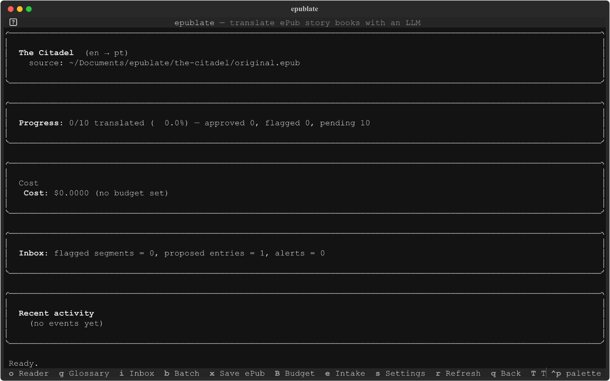

Key bindings (PRD §4.6 / M6):

| Key       | Action                                                             |
| --------- | ------------------------------------------------------------------ |
| `o`       | Reader (interactive segment-by-segment translation)                |
| `g`       | Glossary curator                                                   |
| `i`       | Inbox (flagged segments, proposed entries, alerts)                 |
| `b`       | Run a batch translation                                            |
| `c`       | **Cancel batch** — let in-flight calls finish, stop submitting more |
| `x`       | **Save ePub** — write the translation to disk (works at any point) |
| `B`       | Set / clear the project budget cap                                 |
| `e`       | Helper-LLM book intake (M5)                                        |
| `L`       | LLM activity (deep cost auditing, recent calls)                    |
| `s`       | Settings (read-only LLM config, theme, budget)                     |
| `r`       | Refresh                                                            |
| `q` / `esc` | Back to the previous screen                                      |
| `T`       | Cycle theme (`textual-dark` → `textual-light` → `epublate-contrast`) |
| `?` / `F1`| Open the cheat sheet for the current screen                        |

The batch worker lives on the App, not on the Dashboard. That means
you can dispatch a batch with `b`, leave the project (back out to
the Projects screen, even open a different project) and the run
keeps progressing in the background until it finishes, hits the
budget cap, or you press `c` to cancel. While a batch is active the
Dashboard and Reader both render a live progress strip showing the
chapter count, segment count, state badge (running / cancelling /
paused / cancelled / done), and a two-token cost line — `this batch
$X · project total $Y` — so you can tell at a glance how much the
running batch added on top of the project's pre-batch spend.

The Batch modal exposes a **Helper pre-pass** toggle (default `y`).
When on, the cheap helper model walks each chapter's pending
segments before the translator fires and surfaces fresh proper-noun
candidates as `proposed` glossary entries — so the translator's
prompt is glossary-aware on the first attempt instead of catching
up over a re-run (PRD §4.2 phase 3 / M5). The same pre-pass also
fires automatically for the Reader's per-chapter translate (`b`,
sidebar button, queue ladder) since that's a "batch of one chapter"
under the hood. The helper model is resolved per project via the
LLM-overrides on the Settings → LLM panel, falling back to
`EPUBLATE_LLM_HELPER_MODEL` and finally to the translator model
itself. Type `n` in the modal toggle to skip the pre-pass on an
individual run (e.g. very mature lore, or a model whose helper rate
is the same as its translator rate). The CLI `epublate batch` keeps
the opposite default (`--no-extract`) for backward compatibility —
pass `--extract` to opt in there.

Pre-pass and translation **interleave per chapter** (since the
2026-05 fix): the helper LLM scans chapter 1's pending segments,
that chapter's translation pool fires immediately, then the helper
moves to chapter 2, and so on. The dashboard's status footer shows
"pre-pass: ch X/Y chunk A/B {ok|cached|failed}" while the helper is
running — without that line a slow helper looks like a deadlock
because the segment-count meter doesn't move during pre-pass. Cancel
(`c`) takes effect between chunks and between chapters, and the
project budget cap is enforced inside the helper loop so a runaway
helper can't blow past the cap before the cap-check fires. The
chapter N+1 pre-pass picks up `proposed` entries that chapter N's
pre-pass / translator wrote, so locked / confirmed promotions stay
sticky as the run progresses. Book-wide consistency for proper
nouns introduced late in the work still comes from the Lore Book /
Book Intake (M5), not from per-chapter pre-pass.

### When the LLM endpoint rate-limits you (HTTP 429)

Free-tier endpoints — most notably OpenRouter's free
`*:free` model variants — cap requests per day (e.g. 50/day until
you add a few dollars of credit). When a depleted-quota 429 lands
during a batch, epublate **pauses** the run instead of retrying the
same 429 once per pending segment:

- The provider parses ``Retry-After`` and ``X-RateLimit-Reset`` from
  the response. *Short* waits (≤ 120 s) are honored within the
  per-call retry budget — a transient burst limit clears itself.
  *Long* waits (depleted daily / monthly quotas) lift out as a
  typed ``LLMRateLimitError`` immediately, no retry burned.
- The batch runner pauses with a curator-friendly reason in the
  pause bar / status footer, e.g.: ``rate limit hit: Rate limit
  exceeded: free-models-per-day. Add 6.55 credits to unlock 1000
  free model requests per day (resets in ~5h; switch model, add
  credits, or wait and resume)``. The provider's own error message
  is preserved verbatim so the actionable hint (dollar amount,
  reset window) reaches the curator without digging through logs.
- Pending segments stay ``pending``. After you switch model
  (Settings → LLM overrides, or `EPUBLATE_LLM_MODEL` /
  `EPUBLATE_LLM_HELPER_MODEL`), add credits, or simply wait, press
  `b` again to resume — the cache replays everything that already
  succeeded.
- A rate-limited helper pre-pass (``batch.pre_pass_rate_limited`` in
  the Inbox) pauses the run *before* the translator phase fires, so
  a depleted helper quota can't cascade into a wasted translator
  budget on the same endpoint.

If you regularly hit free-tier daily caps, three options:

1. **Configure a paid model on the same endpoint** for the project
   via Settings → LLM overrides. The free helper / paid translator
   split (or vice versa) is fine — overrides are independent.
2. **Lower concurrency** (default `1`; the Batch modal exposes the
   knob) so a burst-style 429 with a small ``Retry-After`` doesn't
   stack up across workers.
3. **Switch to an unrated endpoint** for batch work. Local Ollama,
   vLLM, or llama.cpp builds don't enforce per-day caps; OpenAI
   proper, Together, and the Azure OpenAI endpoints have higher
   tier-based limits with predictable burst headroom.

A slim **persistent batch status bar** docks at the bottom of every
other main screen (Glossary, Inbox, Settings, LLM activity, and the
Projects landing page) so wandering off the Dashboard never loses
the running tally. The bar disappears the moment the worker drains
and re-appears the moment a new batch starts, so an empty bar always
means "no batch in flight". It mirrors the same state badge and
counters as the Dashboard panel, just compressed onto a single line.

`q` and `Escape` both back out of the current screen everywhere except
the Projects landing screen, where `q` quits. The Escape variant is
hidden from the binding bar to keep the footer compact, but it works
identically.

The cheat sheet introspects the active screen's `BINDINGS`, so it
stays accurate when new actions land. Press `?` (or `F1`) anywhere to
overlay it on the current screen:

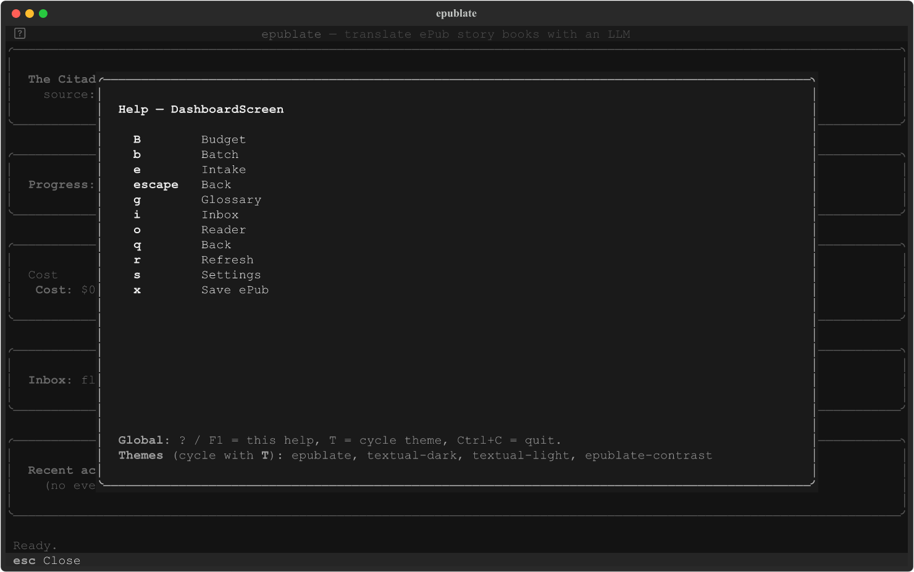

The chosen theme persists across runs in
`~/.config/epublate/ui.toml` (the file is created on demand and
otherwise managed by the TUI; you don't need to edit it by hand).
The `T` keybinding rotates through the four bundled themes —
`epublate` (the warm default), `textual-dark`, `textual-light`, and
the WCAG-AA-tuned `epublate-contrast`:

| `epublate` (default) | `textual-dark` |
| --- | --- |
|  | 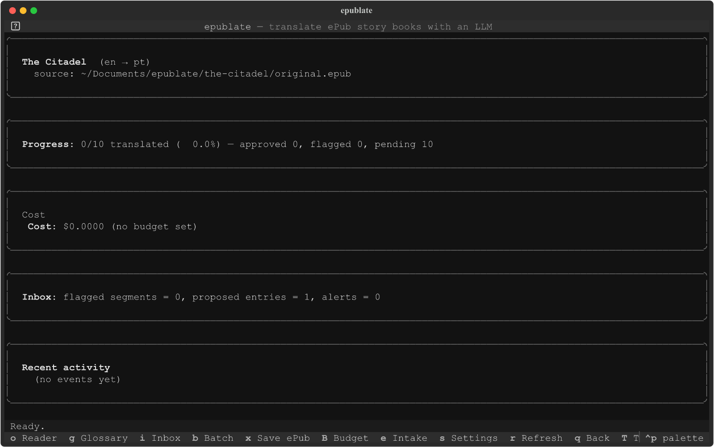 |

| `textual-light` | `epublate-contrast` |
| --- | --- |
| 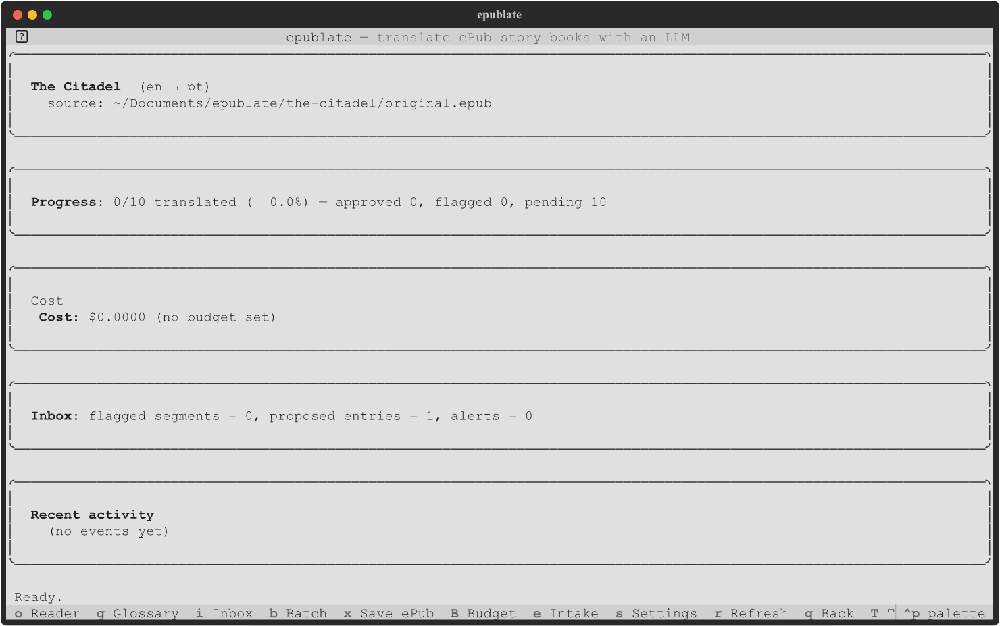 | 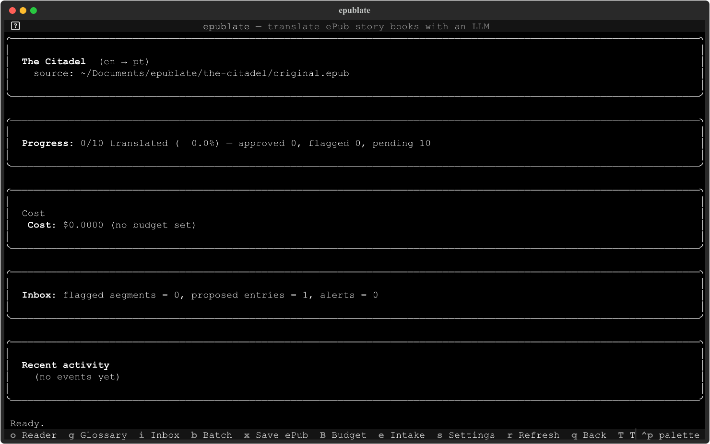 |

## 3. Translate

Two paths are available:

* **Interactively** — press `o` from the Dashboard to open the Reader.
  `t` translates, `j`/`k` navigate segments, `J`/`K` navigate
  chapters, `a` accepts, `e` edits, `r` retries.

  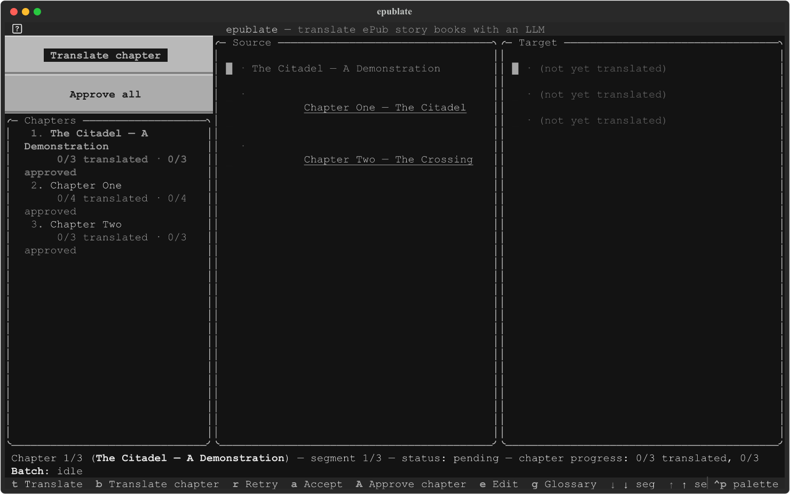

* **Headlessly** — exit the TUI and run a batch:

  ```bash
  uv run epublate --mock-llm batch /tmp/epublate-sample \
      --concurrency 2 --budget 1.00
  ```

  Failures (placeholder-mismatch, locked-glossary violations, LLM
  errors) land in the Inbox; the run pauses if the budget cap is hit.

## 4. Curate

The Inbox (`i` from the Dashboard) groups three kinds of work:

* **Flagged segments** — re-translate or accept-as-is.
* **Proposed glossary entries** — promote to `confirmed` / `locked`,
  edit the target term, or reject. Promoting a `locked` entry can
  trigger a cascade re-translation (PRD F-G-7).
* **Alerts** — budget pauses, LLM errors, intake summaries.

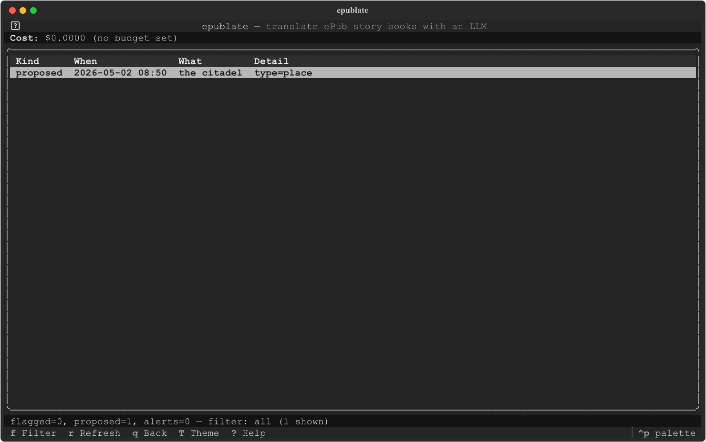

Use `g` for the full Glossary curator: edit translations, lock
entries, manage aliases, view per-entry revision history. The right
pane shows the highlighted entry's notes, alias list, mention count,
and revision log. The table's **Uses** column reads `N (Ms)` — total
mention count plus distinct segments hit; press `o` on a row to open
**Show occurrences**, a per-entry list of every recorded use in book
order with the matched span highlighted (`«…»`), so you can spot a
locked entry mis-firing on common-noun prose. `m` triggers a one-pass
**Merge duplicates** to collapse legacy `(source_term, type)` clones
into a single winning entry with the others' aliases folded in.

**Particle symmetry on save.** When you create or edit an entry, the
modal enforces that the source and target either *both* carry a
leading article / preposition (`the USA → os EUA`) or *neither* does
(`Europe → Europa`, `USA → EUA`). Asymmetric pairs like
`Europe → na Europa` are rejected with an inline error explaining the
mismatch — they cause the translator to emit `"na na Europa"` style
runs in real prose. The auto-proposer that fires after every
translated segment is even stricter: it always strips a leading
particle from each side, so a noisy LLM proposal of `the USA → os EUA`
lands in your DB as `USA → EUA`. If you genuinely want the
article-bearing version, author it manually from the modal — that's
the only path the symmetric form survives. At translation time, a
runtime check soft-flags any segment whose target output still
contains an `"na na X"` / `"the the X"` style run, even though no
locked term was technically violated; flagged segments land in your
Inbox for review.

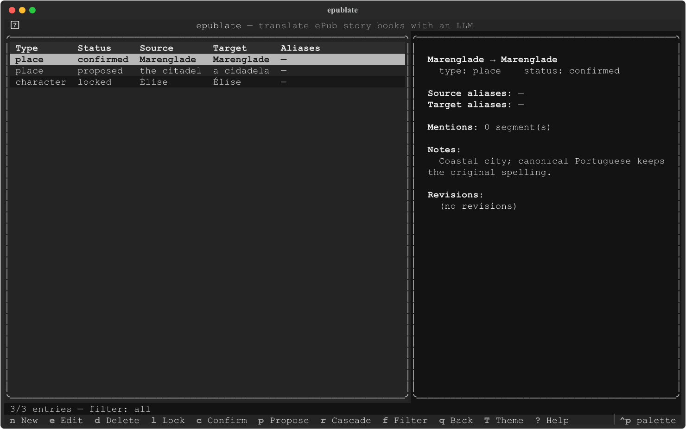

## 5. Inspect cost / progress

```bash
uv run epublate stats /tmp/epublate-sample --json
uv run epublate budget show /tmp/epublate-sample
uv run epublate inbox /tmp/epublate-sample
```

The Dashboard shows the same numbers live; the CLI versions are
useful for shell scripts and CI dashboards.

For deeper LLM cost auditing — per-model spend, per-purpose
breakdown (translate vs extract vs tone-sniff vs cascade), and a
recent-calls table with timestamps and segment ids — open the
**LLM activity** screen with **`L`** from the Dashboard. The
Dashboard's compact panel surfaces the latest few calls inline; the
full screen lifts the limit so you can see where the budget is
going across an entire run. Both views also report input/output
token counts (read from the API's ``usage`` block when present, or
counted with ``tiktoken`` as a fallback) so a runaway prompt or
output is obvious.

## 6. Export the translated ePub

You can save the project as an ePub at **any point** — partial
translations work too. Untranslated segments fall back to the source
text per PRD F-IO-7, so the file is always valid and re-readable in
any reader.

### From the TUI (recommended)

Press **`x`** ("Save ePub") on the Project Dashboard. The modal that
opens lets you tweak the output path — by default it lands next to
`original.epub` as `<book-stem>.<target-lang>.epub` so successive
runs at different translation stages don't overwrite each other.
Click **Browse…** (or press `Ctrl+O`) to pick a different folder; the
filename stays editable. Submit with **`Ctrl+S`**.

The export runs in a background worker, so you can keep batch
translation running and still hit `x` to grab the latest snapshot.
The status bar reports the result; the file is ready as soon as
"Saved …" appears.

### From the CLI

The simplest export writes a (possibly partial) ePub atomically.

```bash
uv run epublate export /tmp/epublate-sample \
    --out /tmp/epublate-sample.epub
```

### Validate with epubcheck (M6)

Two new flags wire the optional epubcheck integration (PRD F-IO-6):

```bash
# Warn-only: print a one-line summary, never block.
uv run epublate export /tmp/epublate-sample \
    --out /tmp/epublate-sample.epub --epubcheck

# Strict: exit non-zero (3) on any error; print up to 5 messages.
uv run epublate export /tmp/epublate-sample \
    --out /tmp/epublate-sample.epub --strict
```

Validation requires the `[epubcheck]` extra (which bundles the
upstream Java JAR) and a working JRE:

```bash
# In a development checkout
uv sync --extra epubcheck

# Or for an installed CLI
uv tool install "epublate[epubcheck]"
```

If the extra isn't installed, or Java isn't on `PATH`, `--strict`
still succeeds — it just prints `epubcheck skipped: ...`. That keeps
the installation footprint small for curators who don't need
external validation.

## 7. Configure a real LLM endpoint

Drop `--mock-llm` and export the canonical environment variables:

```bash
export EPUBLATE_LLM_BASE_URL=https://api.openai.com/v1
export EPUBLATE_LLM_API_KEY=sk-...
export EPUBLATE_LLM_MODEL=gpt-5-mini
export EPUBLATE_LLM_HELPER_MODEL=gpt-5-mini  # optional, defaults to $EPUBLATE_LLM_MODEL
```

Any OpenAI-compatible endpoint works (Azure OpenAI, OpenRouter,
Together, Ollama, vLLM, llama.cpp). The Settings screen (`s` on the
Dashboard) shows the resolved values with the API key redacted to
the first four / last two characters:

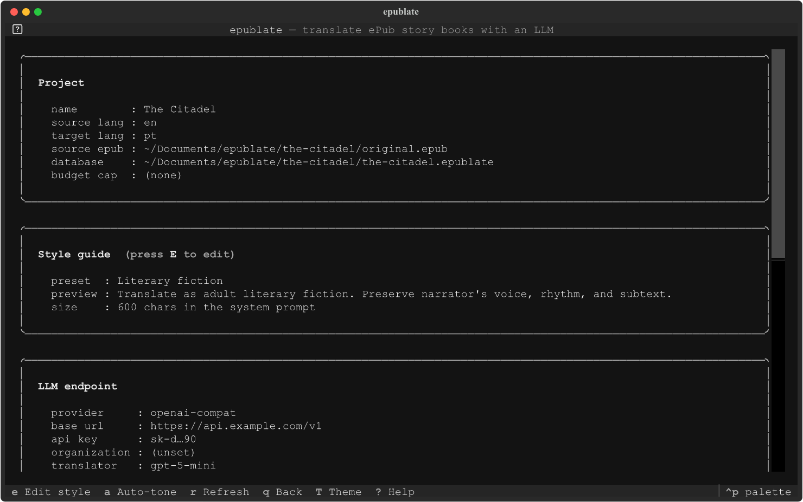

### Reasoning models — speeding up `gpt-oss-*` / `gpt-5-*` / Nemotron

Reasoning models spend most of their wall-clock time on hidden
chain-of-thought before emitting the JSON the pipeline needs. If the
translator or helper feels "very slow" (10–30s per call), the
single-line fix is the standard OpenAI `reasoning_effort` knob:

```bash
export EPUBLATE_LLM_REASONING_EFFORT=low   # minimal | low | medium | high
```

`low` typically cuts latency 3–10× at a small quality cost. Empirical
data point: against `nvidia/nemotron-3-nano-omni-30b-a3b-reasoning:free`
the smoke probe in `scripts/smoke_llm_credentials.py` measured
30.2s → 13.6s on a single translator segment (55% faster), with no
quality regression on the extractor and lore-target probes.

Non-reasoning models on permissive endpoints silently ignore the
field, so leaving the env var set across mixed-endpoint sessions is
generally safe. Per-project overrides (Settings → LLM panel, M6) win
over the env var so one project can run on `high` (quality matters)
while another runs on `low` (speed matters) using the same shell.

If the curator wants to *audit* their own credentials before a long
batch, `scripts/smoke_llm_credentials.py` ships a read-only probe
that hits each LLM channel epublate uses (translator, group
translator, extractor at one-paragraph and pre-pass sizes, lore
target ingest) and reports per-channel pass/fail with latency and
token spend. Configs live in a gitignored `.smoke_configs.json` so
keys never enter git history; see the script's docstring.

## Where things live on disk

```
/tmp/epublate-sample/
  original.epub        # canonical source, never written after `new`
  <name>.epublate      # the SQLite DB (everything: segments, glossary,
                       #   LLM calls, events, edits, decisions)
  <name>.epublate-shm  # SQLite shared-memory file (WAL mode)
  <name>.epublate-wal  # SQLite write-ahead log
~/.config/epublate/
  ui.toml              # persisted theme choice (and other UI prefs)
```

Everything project-scoped lives in the project dir; the user-level
`ui.toml` only carries machine-wide preferences. There is no other
state — quitting and reopening the TUI is always safe.
